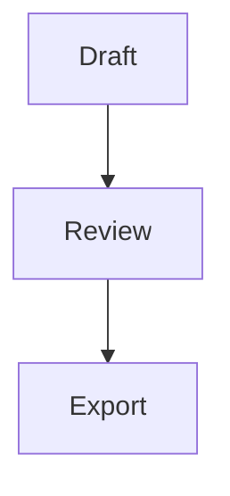

# Conversation markdown

Assistant responses render with the terminal markdown engine ported from Rho. User prompts and system notices remain literal text. This changes the conversation display, not PowerPoint slide content or export formatting.

## Supported content

- ATX headings, emphasis, inline code, links, horizontal rules, and wrapped prose.
- Fenced code blocks with language labels and syntax highlighting. Unknown languages stay readable as plain code. Click **Copy** in a code-panel header to copy its original source rather than the wrapped terminal text. Drag selection still copies visible text.
- Tables with inline formatting, alignment, and width-aware cells.
- Inline math between `$` delimiters and display math between `$$` delimiters. Inline expressions render only when they fit one text row. Taller inline expressions stay as source text. Display expressions use a terminal math panel.
- Mermaid fences for flowcharts, state, sequence, class, entity-relationship, Git, Gantt, and mindmap diagrams. Unsupported, malformed, unsafe, or oversized diagrams fall back to a labeled source panel. Narrow terminals may clip diagrams according to the renderer's width policy.
- Standalone local images, such as ``. Relative paths resolve against the session working directory. Absolute paths, `~/` paths, and local `file://` URLs also work. HTTP and other remote URLs are not fetched. Images mixed into prose use their alt text.

For example:

````markdown
## Result

**Revenue** increased. The model uses $x^2$.

| Quarter | Revenue |
| --- | ---: |
| Q1 | 42 |



$$\frac{1}{2}$$
````

The math renderer is TXM, not full LaTeX. Use compact equations and supported commands such as `\frac`, `\sqrt`, Greek letters, and matrices. Invalid expressions keep a source fallback instead of breaking the conversation.

## Terminal behavior

Styles use slide-builder's terminal-derived palette. Code tokens have semantic ANSI colors; headings use weight rather than decorative accent color. Responses wrap inside the existing conversation padding. Resizing recalculates wrapping, tables, panels, and image sizing.

Incomplete inline markup waits for a stable prefix during streaming. Open fenced code stays visible, and supported Mermaid prefixes can render before the closing fence arrives. An open display-math block shows literal TeX until its closing delimiter arrives. A cursor marks an unfinished response. Completed message rendering is shared between frames. During streaming, completed blocks remain cached while the mutable tail is repainted. Content replacement, width changes, and syntax-grammar readiness invalidate the relevant paint. Unsafe control and bidirectional-format characters are escaped before rendering or code copying.

Image reads, decoding, resizing, and terminal encoding run on a worker thread. Images share the preview's detected graphics protocol and fit the conversation width, with terminal height as their stable height constraint. Growing the prompt does not reload them. PNG, JPEG, GIF, and WebP are supported by the image decoder. Missing files, unsupported paths, or unavailable graphics retain the alt-text fallback. Images partially scrolled offscreen are clipped, not resized. Decode and cache allocation budgets protect the UI from large files. Successful deck renders invalidate cached conversation images so overwritten slide previews can reload.

## Implementation and provenance

The engine comes from `../rho` at revision `0c919640124e6795e7aea9c0d5180687b6316dd3`, principally `crates/rho/src/tui/markdown*`, `terminal_graph*`, syntax highlighting, and text wrapping. It is copied into this repository because Rho does not expose its TUI renderer through the SDK. Builds do not require a neighboring Rho checkout.

- `src/tui/markdown*` owns parsing and terminal markdown output.
- `src/tui/terminal_graph*` owns diagram layout and drawing.
- `src/tui/syntax.rs` and `build.rs` load the bundled language grammars.
- `src/tui/markdown_theme.rs` maps renderer styles to slide-builder's palette.
- `src/tui/conversation_markdown.rs` adds padding, streaming preview, and message caching.
- `src/tui/conversation_images.rs` owns local image loading and terminal protocols.
- `src/tui/chat.rs` combines message and tool rows and resolves copy targets.

This is parity with Rho's custom terminal renderer, not a claim of complete CommonMark or browser HTML support. Rho's append-only scrollback cache and application-specific tool widgets are not part of the port; slide-builder retains its own fullscreen conversation and tool-activity UI.

The copied Rho code is covered by the [MIT license](licenses/rho-MIT.txt). The terminal graph implementation also contains modified Apache-2.0 code from Grok Build. See the [third-party notices](licenses/markdown-third-party-notices.txt) and [Apache license](licenses/Apache-2.0.txt).
